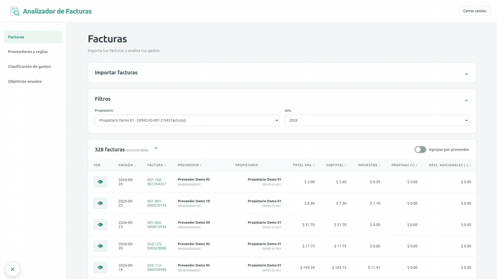
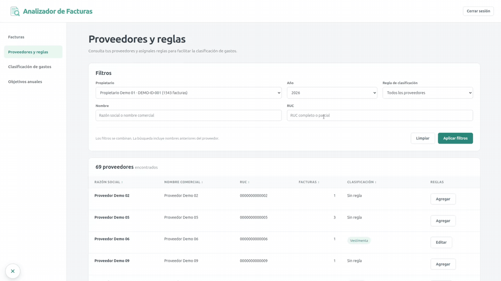
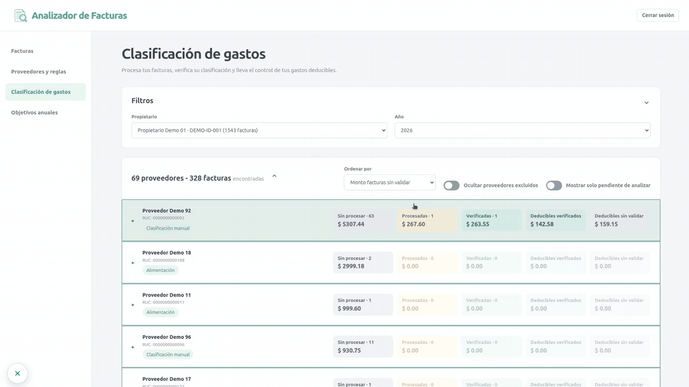
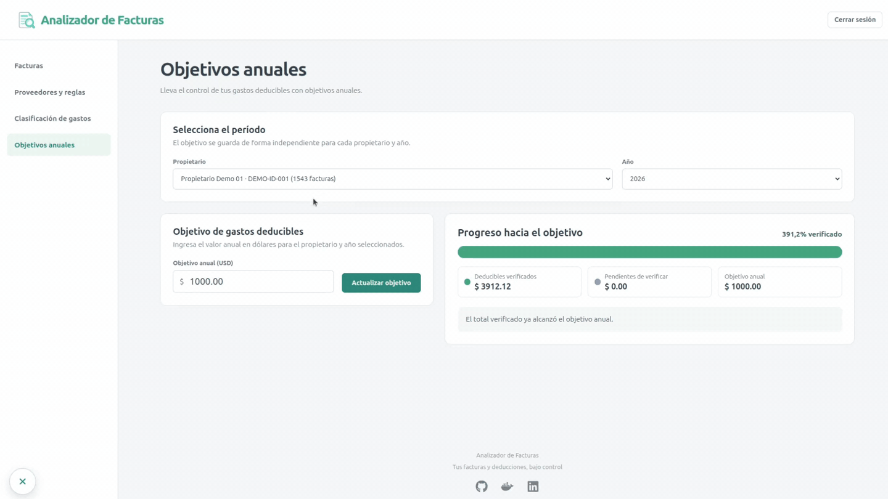

# Analizador de Facturas Ecuador

Aplicación web para importar, organizar y analizar facturas electrónicas en formato XML emitidas por el SRI de Ecuador.

Las facturas se almacenan en una base de datos PostgreSQL junto con su XML original, evitando registros duplicados y conservando el historial de clasificación. Desde la aplicación puedes consultar tus comprobantes, administrar reglas de clasificación de gastos por proveedor, procesar automáticamente los gastos y establecer objetivos anuales de deducción.

Su propósito es facilitar el seguimiento de gastos deducibles y ayudarte a medir el avance hacia tus metas tributarias durante el año.

## Demo

### Facturas

Importa tus facturas, consúltalas mediante filtros y revisa su información en detalle.

Si deseas descargar automáticamente tus facturas del SRI, consulta el proyecto [Descargar comprobantes del SRI](https://github.com/RogerVega33/Descargar-comprobantes-SRI).



### Proveedores y reglas

Consulta tus proveedores y configura reglas para automatizar la clasificación de sus gastos deducibles.



### Clasificación de gastos

Clasifica tus facturas aplicando las reglas configuradas o asigna manualmente la categoría correspondiente. También reconoce cuando una factura ya cuenta con etiquetas de gastos deducibles directamente desde el proveedor.


### Procesamiento automático de gastos

Procesa todas las facturas de un proveedor con un solo clic.



### Objetivos anuales

Define tus objetivos anuales de deducción y consulta mes a mes tu avance.



## Instalación con Docker

Este paquete instala la aplicación Analizador de Facturas usando imágenes públicas de Docker Hub.

Incluye el frontend web, el API y una base de datos PostgreSQL persistente. Es compatible con equipos `amd64` y `arm64` que puedan ejecutar Docker Compose, incluidos servidores, computadores personales y numerosos dispositivos NAS.

## Requisitos

- Docker Engine con el complemento Docker Compose, o Docker Desktop.
- Conexión a Internet durante la primera instalación y las actualizaciones de versión.
- Un puerto disponible para la página web; el predeterminado es `8080`.

## Instalación

1. Descarga o copia el contenido de este repositorio a una carpeta.
2. Copia `.env.example` como `.env`.
3. Abre `.env` y sustituye `POSTGRES_PASSWORD` por una contraseña segura para tu base de datos.
4. Si el puerto `8080` está ocupado, cambia `WEB_PORT`.
5. Desde esa carpeta, ejecuta:

```bash
docker compose pull
docker compose up -d --wait
```

Abre `http://localhost:8080` en el mismo equipo o `http://IP_DEL_EQUIPO:8080` desde la red local. Sustituye `8080` si configuraste otro puerto.

La primera vez que accedas, la aplicación te pedirá crear el usuario administrador.

El API espera a que PostgreSQL esté disponible, aplica automáticamente las migraciones pendientes y después inicia el servidor. El API y PostgreSQL no publican puertos; solamente el frontend es accesible desde el equipo anfitrión.

## Comandos útiles

```bash
# Consultar el estado de la aplicación
docker compose ps

# Consultar los logs
docker compose logs --tail=100 frontend api db

# Detener la aplicación (los datos de la base de datos no se eliminan)
docker compose stop

# Volver a iniciarla
docker compose up -d --wait
```

## HTTPS

Para publicar la aplicación en Internet, utiliza HTTPS mediante un proxy inverso y establece `AUTH_COOKIE_SECURE=true` en `.env`. Consulta [Configuración de un proxy inverso](docs/proxy-inverso.md).

## Actualizaciones y versiones

Consulta [Actualizar o recuperar una versión](docs/actualizacion.md).

Antes de una actualización importante, crea un [respaldo de la base de datos](docs/respaldos.md).

## Persistencia y seguridad

Los datos se guardan en el volumen indicado por `POSTGRES_VOLUME`. `docker compose down` elimina los contenedores pero conserva ese volumen; `docker compose down -v` también elimina los datos y no debe utilizarse en una instalación con información que quieras conservar.

## Licencia

Copyright 2026 Roger Vega.

Los archivos de este repositorio se distribuyen bajo la [Apache License 2.0](LICENSE). Consulta también el archivo de [atribuciones](NOTICE).

Las imágenes Docker utilizadas corresponden al proyecto Analizador de Facturas y se distribuyen conforme a la licencia y los avisos de su proyecto de origen. Las dependencias de terceros conservan sus respectivas licencias.
